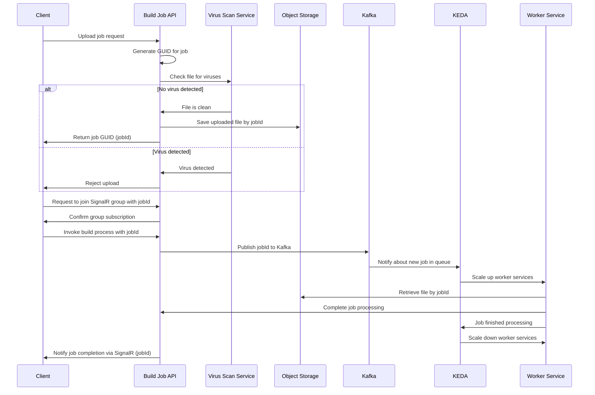

# dotnet build autoscaler



## Development

> [!TIP]
> If you are using VS Code, you can press `F1` and type `Tasks: Run Task` to see the available tasks.
> "Run all services in watch mode" will start docker compose, then start all services in watch mode.

### Using docker compose

First, install Docker and Docker Compose.

Then, run:

```bash
docker compose up -d
```

In a separate terminal, run:

```bash
dotnet watch --project BuildJobApi -lp https
```

In a separate terminal, run:

```bash
dotnet watch --project BuildJobWorker
```

### Clean up

After you are done, you can stop with `Ctrl+C`.

To remove docker containers, run:

```bash
docker compose down
```
